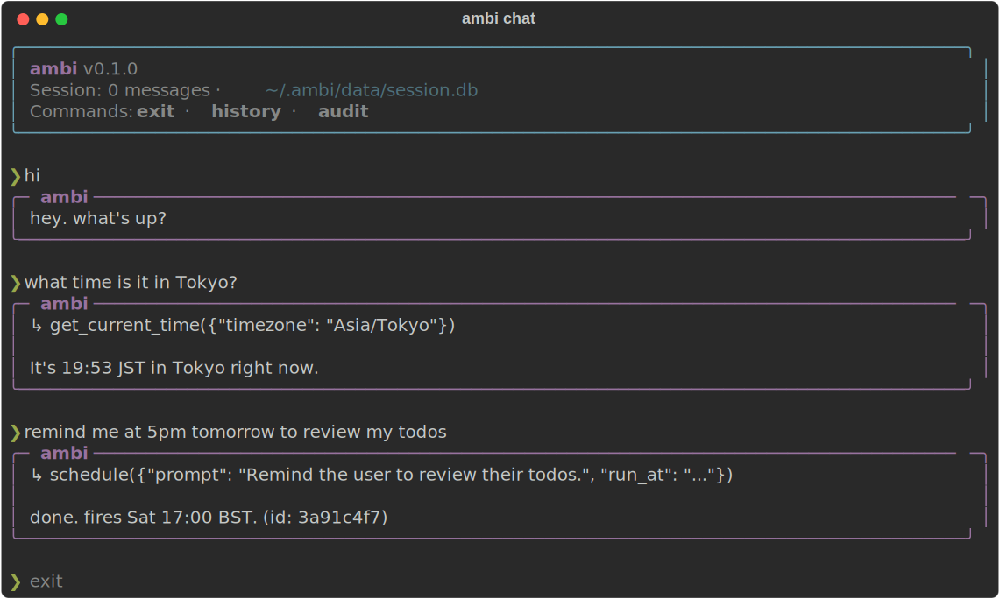

# ambi

> **ambi** — *ambient memory-backed intelligence*. A personal-agent harness that runs always-on, remembers via [Hippocamp](https://github.com/leosoft-company/hippocamp), and verifies what it does.

An agent runtime built on a clean provider seam (a Gemini adapter ships today; other LLMs slot in behind the same `LLMProvider` protocol): a single continuous conversation with first-class skills, action verification (SenseGate), external tool execution, MCP integration, persistent history, scheduled tasks, and Telegram delivery.

Built as the runtime half of a personal-AI stack. Pair it with Hippocamp for long-term memory that follows you across hosts.



> Status: alpha. Working end-to-end against Gemini 2.5 Flash; API may change before 1.0.

---

## What's in the box

| Layer            | What it does                                                      |
|------------------|-------------------------------------------------------------------|
| Loop             | Stateful `Agent.chat()`. Parallel tool dispatch. Tool timeouts. Max-turn guard. Snapshot/rollback on failure. |
| Skills           | YAML-frontmatter markdown skills. Catalog inlined in the system prompt; bodies loaded on demand via `load_skill`. |
| Tools            | `Tool(definition, handler, kind)` — `kind` distinguishes read vs write for SenseGate. Tools run concurrently. |
| Context window   | Sliding window over user-text turns + per-block clipping. Storage stays full-fidelity; only the LLM slice is trimmed. |
| Persistence      | SQLite-backed session via `SqliteStore`. Load on startup, append on each successful `chat()`. |
| SenseGate        | Post-turn LLM judge that compares the assistant's prose against actual tool results. Block-and-retry on writes; flag-only on reads. Configurable. |
| Warden           | Pre-execution authorization. Ordered policies (deny / require-confirmation / allow) gate every tool call: argv validators, egress host allowlist, human-confirmation on outbound actions, cost ceiling. Audited. |
| Injection defense | Tool outputs wrapped in a `<tool_output trust="data">` envelope + sanitized (invisible-char / Unicode-smuggling / marker stripping) before the model, verifier, or summarizer sees them. See [SECURITY.md](SECURITY.md). |
| Scheduling       | Cron + one-shot `schedule()` tool the agent can call itself. Fires via `agent.chat()` so scheduled runs use the same tools and skills. |
| MCP integration  | `McpServer` + `mcp_tools()` wrap any stdio MCP server as ambi `Tool`s. Hippocamp ships as a worked example. |
| Run-command      | Allowlisted external commands via `make_run_command_tool(CommandPolicy)`. Argv-only (no shell), cwd jail, timeout, output cap, forbidden-arg + secret-path denylists. |
| Transports       | `TelegramTransport` — polling, allowlist auth, typing indicator, message splitting, reply-context extraction, `/scheduled` command. |
| Evals            | Behavioral test harness. YAML scenarios (input + assertions on text/tools/cost) run against a real provider via `ambi eval`. Catches prompt regressions unit tests can't. See [Evals](#evals). |
| Observability    | Configurable logging (rotating file + stderr) and per-turn telemetry (trigger, tools, tokens, cost, duration, outcome). Inspect with `ambi logs` / `ambi status`; `/status` over Telegram. |

## Setup (fresh machine)

### 1. Prerequisites

- **Python 3.12 or 3.13**
- **[uv](https://docs.astral.sh/uv/getting-started/installation/)** — recommended for the global CLI install. Plain `pip` also works.

If you don't have uv:

```bash
curl -LsSf https://astral.sh/uv/install.sh | sh   # macOS / Linux
# or: brew install uv
```

### 2. Install the `ambi` CLI

```bash
uv tool install "ambi-core[hippocamp]"
```

This puts `ambi` on your PATH globally. Drop `[hippocamp]` if you don't want long-term memory.

> Until v0.1.0 is on PyPI, install from source instead:
> ```bash
> git clone https://github.com/leosoft-company/ambi.git
> uv tool install --editable ./ambi --with hippocamp
> ```

### 3. Get a Gemini API key

Go to <https://aistudio.google.com/apikey>, sign in with a Google account, **Create API key**. Free tier is enough to play with — Gemini 2.5 Flash is what ambi uses by default.

### 4. Initialize

```bash
ambi init
```

This creates `~/.ambi/` with:

```
~/.ambi/
  .env          # secrets and config (gitignore this if you copy it anywhere)
  skills/       # example skills (time.md, shell.md) you can edit or delete
  data/         # SQLite session DB lives here once you start chatting
```

Edit `~/.ambi/.env` and paste in your Gemini key:

```
GEMINI_API_KEY=AIza...
```

### 5. Try the local REPL

```bash
ambi chat
```

Bordered panels, spinner, paste-friendly prompt, persistent session — say hi and ask it to run `ls` or recall the time.

### 6. (Optional) Telegram bot so you can talk from your phone

This is what makes `ambi` feel like a personal assistant — once `ambi run` is up on your machine, DM the bot from anywhere.

**a. Create the bot.** Open Telegram, search for **@BotFather**, send `/newbot`, follow the prompts. You'll get a token like `1234567890:ABCdef...`.

**b. Find your numeric Telegram user ID.** DM **@userinfobot** — it replies with your ID (e.g. `123456789`). This is what restricts the bot to *you*.

**c. Add both to `~/.ambi/.env`:**

```
TELEGRAM_BOT_TOKEN=1234567890:ABCdef...
TELEGRAM_ALLOWED_USER_IDS=123456789
```

> **Skip the user ID at your peril.** Empty `TELEGRAM_ALLOWED_USER_IDS` means *anyone* who finds your bot can drive your agent (run commands, write to your memory).

**d. Start the daemon:**

```bash
ambi run
```

DM your bot. It'll reply through ambi, persisting everything to `~/.ambi/data/session.db`. Ask it to remind you of something in 10 minutes; the scheduler fires it as a DM. Send `/scheduled` to see pending tasks.

### 7. (Optional) Hippocamp memory

If you installed with `[hippocamp]`, the binary is already on PATH. Just flip the switch in `~/.ambi/.env`:

```
AMBI_USE_HIPPOCAMP=1
```

Restart `ambi run` / `ambi chat`. The agent now has `recall_memory` / `update_memory` tools and a session prompt nudging it to use them. See [Hippocamp](https://github.com/leosoft-company/hippocamp) for what the memory store actually does.

---

### Daily commands

```bash
ambi chat       # local REPL (any directory)
ambi run        # daemon (Telegram + scheduler)
ambi eval       # run behavioral scenarios in evals/ (see Evals)
ambi logs       # recent agent turns (telemetry)
ambi status     # aggregate health: error rate, latency, cost
ambi usage      # token + cost summary
ambi init       # idempotent — safe to re-run after upgrades
ambi version    # print version
```

State (session, tasks, hippocamp log) lives in `~/.ambi/data/`. Override with `AMBI_HOME=/elsewhere/.ambi` if you want multiple isolated profiles.

### From source

```bash
git clone https://github.com/leosoft-company/ambi.git
cd ambi
uv tool install --editable . --with hippocamp   # global install, edits land immediately
# or, for project-local development:
uv sync --extra dev --extra hippocamp
uv run python examples/repl.py
uv run pytest -m "not smoke"
```

`examples/repl.py` and `examples/telegram_bot.py` show the raw library API; the installed `ambi` CLI is the opinionated path.

### Minimal in-code use

```python
from ambi import Agent, ToolRegistry, SqliteStore, load_env
from ambi.providers.google import GoogleProvider

load_env()  # populate os.environ from .env

agent = Agent(
    provider=GoogleProvider(model="gemini-2.5-flash"),
    tools=ToolRegistry(),
    system="You are a concise assistant.",
    store=SqliteStore("data/session.db"),
)
await agent.load()  # picks up prior session if any
reply = await agent.chat("hello")
```

## Architecture

See [ARCHITECTURE.md](ARCHITECTURE.md) for component graph, runtime sequence, the provider seam contract, and how to extend with new skills. Short version:

```
caller ─► Agent ─► LLMProvider (Protocol) ─► GoogleProvider ─► Gemini
            │
            ├─► ToolRegistry  (user tools + load_skill / scheduler / MCP / skill-bundled tools)
            ├─► Warden        (pre-execution authorization — deny / confirm / allow, audited)
            ├─► SkillRegistry (bundled ambi/skills/* + user ~/.ambi/skills/* — catalog in system prompt)
            ├─► SenseGate     (post-turn claim verifier, block-and-retry on writes)
            └─► SqliteStore   (durable session)
```

Tool results are wrapped in a `<tool_output trust="data">` envelope and sanitized before the model sees them; the Warden authorizes every tool call before it runs. See **[SECURITY.md](SECURITY.md)** for the full threat model.

## Adding more LLM providers

Implement the `LLMProvider` protocol (`complete(messages, tools, system, **kw) -> CompletionResult`). The only adapter shipped is `GoogleProvider` for Gemini via `google-genai`. Anthropic/OpenAI/local-model adapters slot in the same way — see `ambi/providers/google.py` for the normalized ↔ provider-native translation pattern.

## Extending — adding a skill

Each skill is a **self-contained directory** under `ambi/skills/<name>/` with a `SKILL.md` (prose guidance for the model) and an optional `tools.py` (Python implementations + a `register()` entry point). The agent discovers and wires them automatically — no edits to `build.py`, the registry, or the agent loop.

```
ambi/skills/
  time/SKILL.md                  ← prose only
  shell/SKILL.md                 ← prose only
  obsidian/
    SKILL.md                     ← prose: PARA conventions, default-to-Inbox
    tools.py                     ← obsidian_save / list / search / read / delete
                                    + def register(tools): wires them if OBSIDIAN_VAULT set
```

To add a new tool-bearing skill — say, `weather`:

```
ambi/skills/weather/
  __init__.py    (empty)
  SKILL.md       prose
  tools.py       handlers + def register(tools): ...
```

**`SKILL.md`**:

```markdown
---
name: weather
description: When the user asks about current weather or forecasts.
---

Use `get_weather(location)` to fetch live conditions. Return temperature,
condition, and a one-line outlook — no padding.
```

**`tools.py`**:

```python
import os
from ambi.tool import Tool, ToolRegistry
from ambi.types import ToolDef

async def _get_weather(args: dict) -> str:
    # ... call your favourite weather API ...
    return f"{args['location']}: 18°C, partly cloudy."

def register(tools: ToolRegistry) -> None:
    if not os.getenv("WEATHER_API_KEY"):
        return                      # skill stays dormant, no error
    tools.register(Tool(
        definition=ToolDef(
            name="get_weather",
            description="Get current weather for a location.",
            input_schema={
                "type": "object",
                "properties": {"location": {"type": "string"}},
                "required": ["location"],
            },
        ),
        handler=_get_weather,
        kind="read",                # write tools get gated by SenseGate
    )),
```

`register_bundled_skill_tools()` picks this up at agent startup. Skills self-decide whether they're configured — users without `WEATHER_API_KEY` get a dormant skill the catalog mentions but the model won't call.

**Prose-only skills** (no `tools.py`) are also valid — when the underlying tool already exists in another layer (e.g. the `shell` skill points at the built-in `run_command`).

**User overrides:** drop `~/.ambi/skills/<name>/SKILL.md` (or a flat `<name>.md`) to shadow the bundled prose of the same skill. Same-name user skills win the catalog slot, but Python tools always come from the installed package — users can't inject code at runtime.

See [ARCHITECTURE.md § Skills](ARCHITECTURE.md#skills--progressive-disclosure-as-self-contained-packages) for the full design rationale (advisory-vs-authoritative, registration ordering, override precedence).

## Security

This is real-execution software running real tools on your machine. The
defaults are personal-use defaults, not multi-tenant production defaults. The
primary threat is **prompt injection via tool output** (a poisoned page or
MCP response trying to hijack the agent), and the design assumes the model
*can* be hijacked — so enforcement lives in the tool layer, not in prompts.

Two kinds of defense, layered:

- **Reduce the odds (soft).** Tool results are wrapped in a
  `<tool_output trust="data">` envelope and sanitized (invisible-char /
  Unicode-smuggling / injection-marker stripping) before the model — and the
  SenseGate verifier and compaction summarizer — see them.
- **Cap the blast radius (hard).** The **Warden** authorizes every tool call
  before it runs (deny / require-confirmation / allow, audited). Defaults:
  destructive-argv denial, an **egress host allowlist** (exfil cut),
  **human-confirmation** on outbound actions (fail-closed if no confirmer),
  and a daily cost ceiling. `run_command` adds an argv[0] allowlist,
  forbidden-arg blocking (`-exec`/`-delete`), and a **secret-path denylist**
  (`.env`, `~/.ssh`, …).

Other notes: **MCP servers** and installed tool code run as trusted
subprocesses inheriting your environment — vet what you wire in. **Skills**
are advisory, not authoritative. **Telegram** defaults to
`TELEGRAM_ALLOWED_USER_IDS` empty (= allow everyone) — set it before exposing
the bot.

**See [SECURITY.md](SECURITY.md) for the full threat model, configuration
knobs, and the residual gaps we have *not* solved.**

## Hippocamp companion

[Hippocamp](https://github.com/leosoft-company/hippocamp) is the sibling
project: a portable, persistent memory store accessed over MCP. The
integration ships in `ambi/integrations/hippocamp.py` as a worked example
of the generic MCP wrapping.

```bash
pip install "ambi-core[hippocamp]"
```

Then in `.env`:

```
AMBI_USE_HIPPOCAMP=1
```

`hippocamp-mcp` lives on PATH after install; you only need
`HIPPOCAMP_CMD` if you run from a venv that isn't activated.

## Tests

```bash
uv run pytest -m "not smoke"   # unit suite — no network
uv run pytest -m smoke         # live smoke against real Gemini (needs GEMINI_API_KEY)
uv run pytest                  # both
```

## Evals

Unit tests cover the *harness*; **evals** cover *behavior* — they catch prompt
regressions pytest can't. ("After editing `system.md`, does it still answer
general knowledge without firing `recall_memory`? Does it still produce text
after a tool call instead of an empty reply?") Each scenario runs against a
real provider and is graded by inspecting the streamed events + final text.

```bash
ambi eval                          # run every scenario in evals/scenarios/
ambi eval evals/scenarios/03_tool_followup_text.yaml   # one file
ambi eval path/to/dir              # a custom directory
```

Needs `GEMINI_API_KEY`. Exit code is non-zero if any scenario fails (CI-friendly).
Flaky empty streams are retried up to `AMBI_EVAL_MAX_ATTEMPTS` (default 2).

A **scenario** is a YAML file: a user `input` plus a list of `assert`ions.

```yaml
name: tool_followup_text
description: After a tool call, the agent must still produce text.
input: "What time is it in Tokyo right now?"
assert:
  - tool_called: get_current_time
  - text_matches: '(?i)tokyo|jst|asia'
  - text_not_matches: '^\s*$'           # never an empty reply
  - text_not_matches: '(?i)happy to help'
```

Assertion types: `text_contains`, `text_not_contains`, `text_matches`,
`text_not_matches` (regex), `tool_called`, `tool_not_called`,
`max_input_tokens`, `max_output_tokens`, `max_cost_usd`. The token/cost
assertions bind to real per-scenario usage captured from the provider, and
each scenario's tokens + cost are shown in the report and summary.

A scenario can declare a **setup** block to seed state — environment overrides
(`{tmp_dir}` is substituted) and `prepare` actions that build fixtures in a
per-scenario temp dir (cleaned up after). The built-in `create_obsidian_notes`
action seeds a vault; register your own with `register_prepare_action()`.

```yaml
setup:
  env:
    OBSIDIAN_VAULT: "{tmp_dir}/vault"
  prepare:
    - create_obsidian_notes: { count: 150, folders: [Inbox, Areas/Work] }
input: "use obsidian_list to summarise my vault"
assert:
  - tool_called: obsidian_list
  - text_not_matches: "(?i)clipped|cannot retrieve"
```

## Observability

Logging is configured at startup (`ambi run` / `chat` / `eval`): the `ambi.*`
loggers write to a rotating file at `~/.ambi/logs/ambi.log`, and the daemon
also logs to stderr. Level via `AMBI_LOG_LEVEL` (default INFO). Without this,
the library's log calls go nowhere — so configure it (the CLI does) before
relying on logs.

Every agent turn records one telemetry row to `~/.ambi/data/telemetry.db`:
trigger (chat / telegram / scheduled / eval), tools called, tokens, cost,
duration, outcome (ok / error / max_turns), Warden denials, and whether
SenseGate flagged it — correlated by a turn id that also appears in the logs.

```bash
ambi logs -n 30     # recent turns as a table
ambi status         # error rate, latency p50/p95, cost, by-trigger counts
```

Over Telegram, `/status` returns the same health summary. Token/cost totals
across all calls (incl. SenseGate + compaction) live in `ambi usage`.

## Project layout

```
ambi/
  loop.py             Agent (chat + chat_stream), MaxTurnsExceeded
  types.py            Message/Block, CompletionResult, streaming events
  tool.py             Tool, ToolRegistry, ToolKind (read/write)
  provider.py         LLMProvider Protocol
  providers/google.py Gemini adapter (google-genai)
  skills/             Bundled self-contained skill packages
    __init__.py         SkillRegistry, load_skill, register_bundled_skill_tools
    time/SKILL.md
    shell/SKILL.md
    obsidian/
      SKILL.md          prose guidance
      tools.py          implementation + register() entry point
  sensegate.py        Post-turn action verifier (LLM judge + audit log)
  warden.py           Pre-execution authorization policies (deny/confirm/allow)
  scheduler.py        TaskStore + Scheduler + schedule()/list/cancel tools
  store.py            SqliteStore (durable session persistence)
  run_command.py      Allowlisted external commands (+ forbidden-arg / secret-path denylists)
  evals.py            Behavioral eval harness (scenario model, assertions, runner, setup)
  observability.py    Logging config + per-turn telemetry store + metrics
  mcp.py              McpServer + mcp_tools() wrapper
  integrations/
    hippocamp.py        MCP server wrapper for Hippocamp memory
  transports/
    telegram.py         Telegram polling + streaming progressive edits
  cli/                `ambi` subcommands: init / run / chat / eval / version
    system.md           bundled default personality
evals/                Behavioral scenarios
  scenarios/*.yaml      input + assertions, run by `ambi eval`
examples/             Raw library API demos (repl.py, telegram_bot.py)
tests/                pytest, asyncio-mode auto (305 unit + 3 live smoke)
docs/                 Demo SVG + render script
```

## License

[Apache 2.0](LICENSE)

Authored by [Prageeth Charith](https://github.com/prageethcs), maintained
under [Leosoft](https://github.com/leosoft-company).
